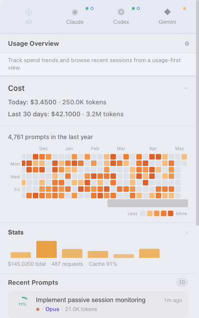
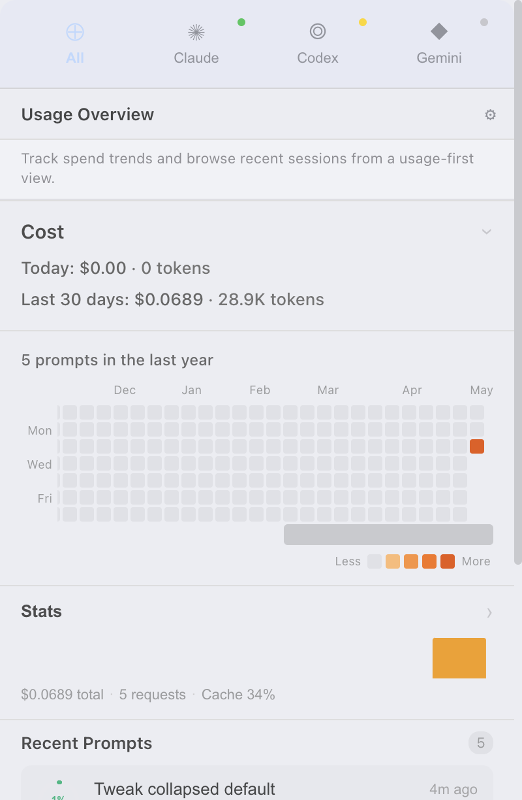
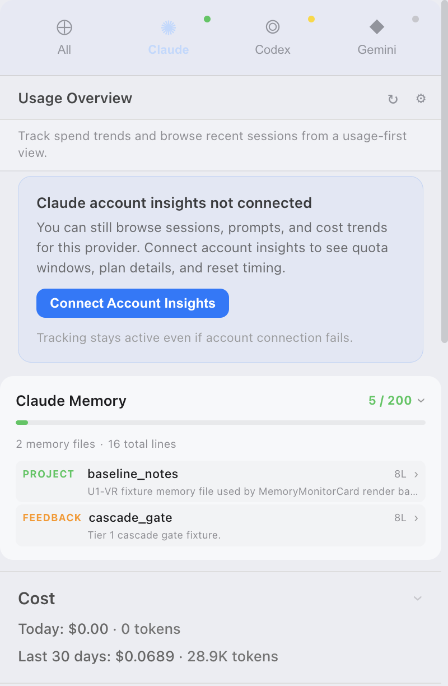
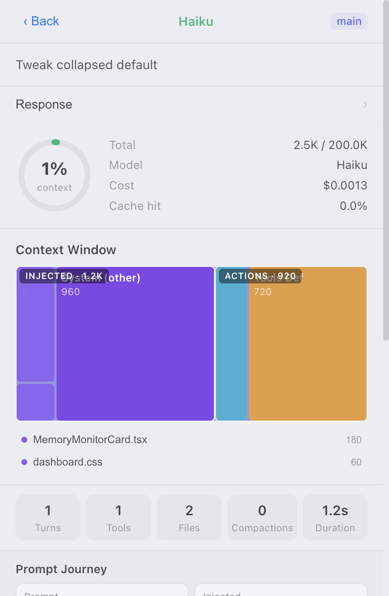
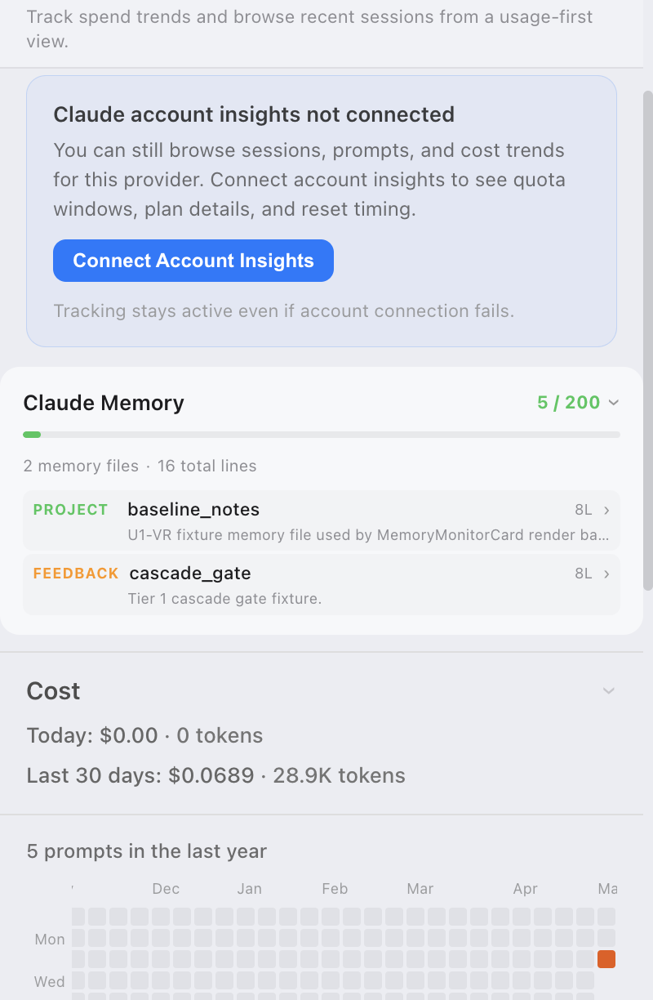
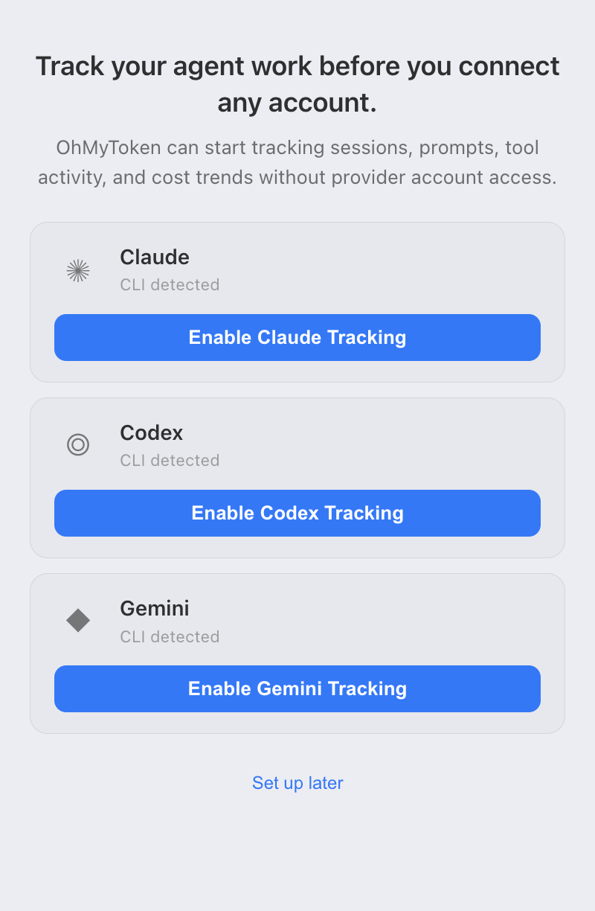
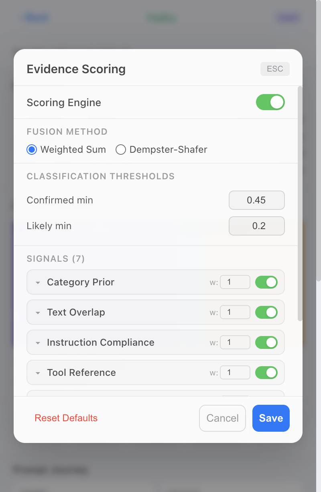

<p align="center">
  
</p>

<h1 align="center">OhMyToken 🪙</h1>

<p align="center"><strong>Track AI coding agents locally — no account connection required.</strong></p>

<p align="center">
  
  
  
  
</p>

<p align="center">
  
</p>
<p align="center">
  <sub>Captured via <a href="https://github.com/vercel-labs/agent-browser">agent-browser</a> against the renderer mock harness — same window size as the real Electron app (400×640).</sub>
</p>

A privacy-first usage monitor for **Claude**, **Codex**, and **Gemini**. Tracking starts the moment you run a CLI session. No login, no OAuth, no cloud sync. Connect a provider account later if you want plan quotas and reset timing on top.

Built with Electron + React. Runs locally on macOS.

> **What it is.** A **full local dashboard** for your AI coding agents — heatmap, treemap, cache analysis, evidence scoring. Focused on the three CLIs you spend most of your day in: Claude, Codex, and Gemini.

---

## Install

### Requirements

- macOS 12+ (Monterey or later)
- Node.js `22.x` if building from source

### GitHub Releases (recommended)

Download the latest signed DMG from the [Releases page](../../releases/latest).

### Homebrew

Install from the project tap:

```bash
brew tap mercleodev/tap
brew install --cask ohmytoken
```

The tap currently tracks pre-release builds until the stable v1.0 cask is published. See [docs/QA-HOMEBREW-DISTRIBUTION.md](./docs/QA-HOMEBREW-DISTRIBUTION.md) for release flow details.

### Build from source

```bash
git clone <repo-url>
cd ohmytoken
nvm use 22
npm install
npm run electron:dev
```

### First run

1. The app shows an onboarding screen with a CLI card per provider.
2. Pick one, run a normal session in that CLI.
3. Your first tracked activity appears automatically.

No account connection required. Connect accounts later from **Settings → Connections** if you want plan quotas and credit balance.

---

## Providers

Deep tracking for the three CLIs developers actually use day-to-day.

| Provider | Session log watcher | Proxy capture | Plan quota (account) | Credit balance (account) |
|---|---|---|---|---|
| **Claude** (Anthropic) | ✓ | ✓ | ○ optional | ○ optional |
| **Codex** (OpenAI) | ✓ | ✓ | ○ optional | ○ optional |
| **Gemini** (Google) | ~ planned | ✓ | ○ optional | ○ optional |

---

## Features

### Always-on (no account needed)

- **Multi-provider unified view** — Claude, Codex, Gemini in one dashboard
- **Cost breakdown** — today and rolling 30-day USD
- **Context window per turn** — see how it fills up
- **Cache growth chart** — cache-read vs cache-create with compaction markers
- **Token composition** — cache-read / cache-create / input / output split
- **Prompt heatmap** — 365-day activity calendar
- **Cost treemap** — visual breakdown by prompt
- **Session and prompt detail** — drill into tool calls, injected files, evidence scores
- **MCP insights** — tool call analysis
- **Session alerts** — cache explosion, low efficiency, long-session warnings
- **Guardrail assessment** — evidence-based scoring
- **Backfill engine** — recover historical usage from session logs
- **Tray quick view** — live status from the menu bar

### Optional (when a provider account is connected)

- **Radial usage gauges** — session / weekly / model quota with reset timing
- **Credit balance** — API prepaid balance (granted / used / expiry)
- **Plan identity** — Pro / Max / Team / Free / API

---

## Screenshots

Captured directly from the React renderer via [agent-browser](https://github.com/vercel-labs/agent-browser) at the real Electron window size (400×640, DPR 2). Mock fixtures shown — no real user data.

<table>
  <tr>
    <td width="50%"></td>
    <td width="50%"></td>
  </tr>
  <tr>
    <td><strong>Unified dashboard.</strong> Cost, 365-day prompt heatmap, stats, and recent prompts in one view.</td>
    <td><strong>Per-provider tab.</strong> Optional account-insights CTA, Claude memory monitor, and provider-scoped cost.</td>
  </tr>
  <tr>
    <td width="50%"></td>
    <td width="50%"></td>
  </tr>
  <tr>
    <td><strong>Prompt detail.</strong> Context-window treemap, model and cost, cache hit, injected files, and prompt journey.</td>
    <td><strong>Memory monitor.</strong> Claude memory files expanded with byte usage against the 200-line context budget.</td>
  </tr>
  <tr>
    <td width="50%"></td>
    <td width="50%"></td>
  </tr>
  <tr>
    <td><strong>First-run onboarding.</strong> Detected CLIs are listed with per-provider enable buttons — no account hookup required.</td>
    <td><strong>Evidence scoring.</strong> Per-signal weights and thresholds for the guardrail assessment engine.</td>
  </tr>
</table>

---

## Privacy

Privacy is verifiable, not just promised.

- **Local SQLite, no remote sync.** All usage data lands in a local DB on your machine. Nothing is sent to any external server.
- **Zero telemetry.** No analytics, no event beacons, no anonymous metrics. The app does not phone home.
- **Reads only known paths.** Watches `~/.claude`, `~/.codex/sessions`, and provider auth files. No filesystem crawl.
- **Loopback proxy only.** The proxy lives on `localhost:8780`. Off-machine traffic is never inspected.

---

## macOS permissions

The app asks for a small, scoped set of permissions on first launch.

- **Network — loopback only.** Required to run the local proxy on `localhost:8780`. No outbound connections except to provider APIs you already use from the CLI.
- **Read access to provider session paths.** `~/.claude` and `~/.codex/sessions` for log watchers. The app reads the JSONL append stream as your CLIs write to it.
- **Keychain (optional).** Only when a provider account is connected. The OAuth token is stored in the macOS Keychain. Disconnect at any time and the token is wiped.

The app does not request Accessibility, Screen Recording, or Full Disk Access permissions.

---

## How tracking evolves

Three runtime states. Account state is independent.

| Tracking state | What's happening |
|---|---|
| `not_enabled` | App is installed. Pick a provider on the onboarding screen. |
| `waiting_for_activity` | Watcher is up. Run any prompt in the CLI to seed the dashboard. |
| `active` | Live tracking. Cost, context, history, and analytics all populated. |

Account state: `not_connected → connected` (or `expired` / `access_denied` / `unavailable`). The dashboard adapts — runtime-only when no account, gauges and credit balance added on top when connected.

---

## Architecture

```
electron/          Electron main process
  proxy/           HTTP proxy — intercept, parse SSE, calculate cost
  hooks/           Stop-hook capture path — transcript reader + scan builder
  db/              SQLite persistence layer
  providers/       Multi-provider session watchers and account fetchers
  watcher/         Generic session-file watcher
  backfill/        Historical recovery plugins (Claude, Codex)
  evidence/        Evidence scoring engine
src/               React frontend — usage dashboard and visualizations
bin/               User-facing CLI entrypoints (e.g., Stop-hook script)
assets/            Tray icons, sprites, marketing
```

### Tech stack

| Layer | Technology |
|---|---|
| Desktop shell | Electron 28 |
| Frontend | React 18, TypeScript, Tailwind CSS |
| Charts | Recharts |
| Animations | Framer Motion |
| Database | better-sqlite3 |
| Tokenizer | js-tiktoken |
| Runtime | Node.js 22 |

---

## Docs

- [Contributing](./CONTRIBUTING.md) — commit conventions, quality gates, PR requirements
- [Open-source workflow](./OPEN-SOURCE-WORKFLOW.md) — issue / branch / PR / release process
- [SDD methodology](./docs/sdd/README.md) — Spec-Driven Delivery rules
- [Build and release](./docs/BUILD-RELEASE.md) — DMG distribution checklist
- [Security policy](./SECURITY.md)
- [Homebrew QA distribution](./docs/QA-HOMEBREW-DISTRIBUTION.md)

---

## Getting started (dev)

```bash
# Prerequisites: Node 22, macOS 12+
nvm use 22
npm install

# Dev — Electron + Vite renderer with HMR
npm run electron:dev

# Pre-commit baseline (also runs automatically via .githooks)
npm run typecheck
npm run lint
npm run test
```

### Build from source

```bash
# Production DMG
npm run build
```

Outputs to `dist/` as a signed `.dmg` when signing credentials are configured. See [docs/BUILD-RELEASE.md](./docs/BUILD-RELEASE.md) for the full release checklist.

---

## Related

- [ccusage](https://github.com/ryoppippi/ccusage) — CLI usage scanner. Inspiration for the local-first parsing approach.

## Looking for a Windows or Linux version?

OhMyToken is macOS-first today. The session watchers and proxy core are platform-agnostic, but tray UX, packaging, and signing are scoped to macOS for v1.0. Windows and Linux ports are tracked on the roadmap based on community demand — please [open an issue](../../issues) if you want to help.

---

## Credits

- Inspired by [ccusage](https://github.com/ryoppippi/ccusage).
- Built on [Electron](https://www.electronjs.org/), [React](https://react.dev/), and [Tailwind CSS](https://tailwindcss.com/).
- Tray sprite art and brand mark: project-original.

## License

[Apache License 2.0](./LICENSE) — Not affiliated with Anthropic, OpenAI, or Google.
